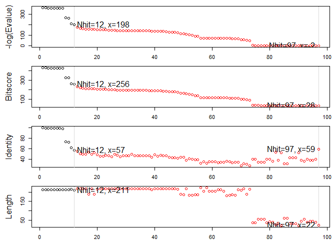
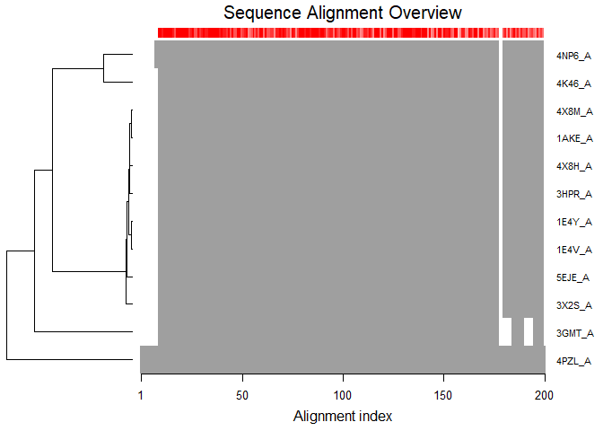
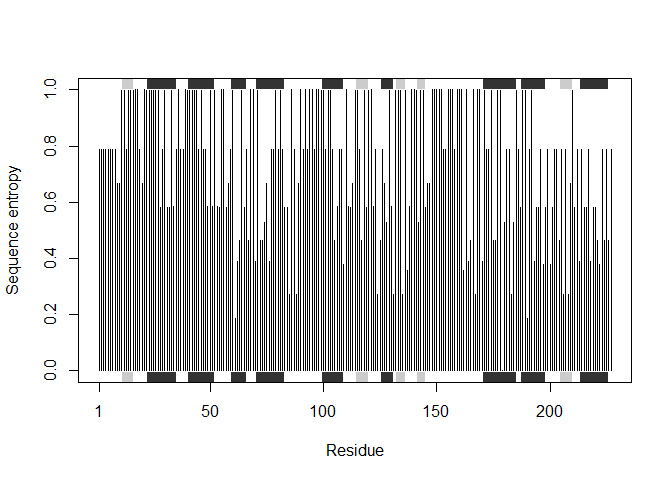

Untitled
================

PDB databse
===========

Q1
==

``` r
db <-read.csv("Data Export Summary.csv", row.names=1)
head(db)
```

    ##                     Proteins Nucleic.Acids Protein.NA.Complex Other  Total
    ## X-Ray                 126880          2012               6547     8 135447
    ## NMR                    11062          1279                259     8  12608
    ## Electron Microscopy     2277            31                800     0   3108
    ## Other                    256             4                  6    13    279
    ## Multi Method             129             5                  2     1    137

Q2
==

``` r
(db$Total/sum(db$Total))*100
```

    ## [1] 89.35736481  8.31777489  2.05041595  0.18406244  0.09038191

Q3 How many are proteins
========================

``` r
(sum(db$Proteins)/sum(db$Total))*100
```

    ## [1] 92.75955

Q4 1-HIV protoase
=================

There are 1157 as of 2019-05-07

``` r
library(datapasta)
data.frame(stringsAsFactors=FALSE,
          V1 = c("X-Ray", "NMR", "Electron Microscopy", "Other",
                 "Multi Method", "Total"),
          V2 = c(126880, 11062, 2277, 256, 129, 140604),
          V3 = c(2012, 1279, 31, 4, 5, 3331),
          V4 = c(6547, 259, 800, 6, 2, 7614),
          V5 = c(8, 8, 0, 13, 1, 30),
          V6 = c(135447, 12608, 3108, 279, 137, 151579)
)
```

    ##                    V1     V2   V3   V4 V5     V6
    ## 1               X-Ray 126880 2012 6547  8 135447
    ## 2                 NMR  11062 1279  259  8  12608
    ## 3 Electron Microscopy   2277   31  800  0   3108
    ## 4               Other    256    4    6 13    279
    ## 5        Multi Method    129    5    2  1    137
    ## 6               Total 140604 3331 7614 30 151579

Section \#3

``` r
library(bio3d)

pdb<- read.pdb("1hsg.pdb")
pdb
```

    ## 
    ##  Call:  read.pdb(file = "1hsg.pdb")
    ## 
    ##    Total Models#: 1
    ##      Total Atoms#: 1686,  XYZs#: 5058  Chains#: 2  (values: A B)
    ## 
    ##      Protein Atoms#: 1514  (residues/Calpha atoms#: 198)
    ##      Nucleic acid Atoms#: 0  (residues/phosphate atoms#: 0)
    ## 
    ##      Non-protein/nucleic Atoms#: 172  (residues: 128)
    ##      Non-protein/nucleic resid values: [ HOH (127), MK1 (1) ]
    ## 
    ##    Protein sequence:
    ##       PQITLWQRPLVTIKIGGQLKEALLDTGADDTVLEEMSLPGRWKPKMIGGIGGFIKVRQYD
    ##       QILIEICGHKAIGTVLVGPTPVNIIGRNLLTQIGCTLNFPQITLWQRPLVTIKIGGQLKE
    ##       ALLDTGADDTVLEEMSLPGRWKPKMIGGIGGFIKVRQYDQILIEICGHKAIGTVLVGPTP
    ##       VNIIGRNLLTQIGCTLNF
    ## 
    ## + attr: atom, xyz, seqres, helix, sheet,
    ##         calpha, remark, call

``` r
attributes(pdb)
```

    ## $names
    ## [1] "atom"   "xyz"    "seqres" "helix"  "sheet"  "calpha" "remark" "call"  
    ## 
    ## $class
    ## [1] "pdb" "sse"

``` r
head(pdb$atom)
```

    ##   type eleno elety  alt resid chain resno insert      x      y     z o
    ## 1 ATOM     1     N <NA>   PRO     A     1   <NA> 29.361 39.686 5.862 1
    ## 2 ATOM     2    CA <NA>   PRO     A     1   <NA> 30.307 38.663 5.319 1
    ## 3 ATOM     3     C <NA>   PRO     A     1   <NA> 29.760 38.071 4.022 1
    ## 4 ATOM     4     O <NA>   PRO     A     1   <NA> 28.600 38.302 3.676 1
    ## 5 ATOM     5    CB <NA>   PRO     A     1   <NA> 30.508 37.541 6.342 1
    ## 6 ATOM     6    CG <NA>   PRO     A     1   <NA> 29.296 37.591 7.162 1
    ##       b segid elesy charge
    ## 1 38.10  <NA>     N   <NA>
    ## 2 40.62  <NA>     C   <NA>
    ## 3 42.64  <NA>     C   <NA>
    ## 4 43.40  <NA>     O   <NA>
    ## 5 37.87  <NA>     C   <NA>
    ## 6 38.40  <NA>     C   <NA>

``` r
head(pdb$atom)[1:2, c("eleno", "elety", "x","y", "z")]
```

    ##   eleno elety      x      y     z
    ## 1     1     N 29.361 39.686 5.862
    ## 2     2    CA 30.307 38.663 5.319

``` r
pdb$atom$elety[1:2]
```

    ## [1] "N"  "CA"

`{r} #plot.bio3d(pdb$atom$b[pdb$calpha], sse=pdb, typ="l", ylab=“B-factor”) #`
==================================================================================

``` r
pdb$xyz
```

    ## 
    ##    Total Frames#: 1
    ##    Total XYZs#:   5058,  (Atoms#:  1686)
    ## 
    ##     [1]  29.361  39.686  5.862  <...>  30.112  17.912  -4.791  [5058] 
    ## 
    ## + attr: Matrix DIM = 1 x 5058

atom.select (pdb, "protein", value =TRUE)

``` r
atom.select (pdb, "protein", value =TRUE)
```

    ## 
    ##  Call:  trim.pdb(pdb = pdb, sele)
    ## 
    ##    Total Models#: 1
    ##      Total Atoms#: 1514,  XYZs#: 4542  Chains#: 2  (values: A B)
    ## 
    ##      Protein Atoms#: 1514  (residues/Calpha atoms#: 198)
    ##      Nucleic acid Atoms#: 0  (residues/phosphate atoms#: 0)
    ## 
    ##      Non-protein/nucleic Atoms#: 0  (residues: 0)
    ##      Non-protein/nucleic resid values: [ none ]
    ## 
    ##    Protein sequence:
    ##       PQITLWQRPLVTIKIGGQLKEALLDTGADDTVLEEMSLPGRWKPKMIGGIGGFIKVRQYD
    ##       QILIEICGHKAIGTVLVGPTPVNIIGRNLLTQIGCTLNFPQITLWQRPLVTIKIGGQLKE
    ##       ALLDTGADDTVLEEMSLPGRWKPKMIGGIGGFIKVRQYDQILIEICGHKAIGTVLVGPTP
    ##       VNIIGRNLLTQIGCTLNF
    ## 
    ## + attr: atom, helix, sheet, seqres, xyz,
    ##         calpha, call

``` r
pdb$atom$resid
```

    ##    [1] "PRO" "PRO" "PRO" "PRO" "PRO" "PRO" "PRO" "GLN" "GLN" "GLN" "GLN"
    ##   [12] "GLN" "GLN" "GLN" "GLN" "GLN" "ILE" "ILE" "ILE" "ILE" "ILE" "ILE"
    ##   [23] "ILE" "ILE" "THR" "THR" "THR" "THR" "THR" "THR" "THR" "LEU" "LEU"
    ##   [34] "LEU" "LEU" "LEU" "LEU" "LEU" "LEU" "TRP" "TRP" "TRP" "TRP" "TRP"
    ##   [45] "TRP" "TRP" "TRP" "TRP" "TRP" "TRP" "TRP" "TRP" "TRP" "GLN" "GLN"
    ##   [56] "GLN" "GLN" "GLN" "GLN" "GLN" "GLN" "GLN" "ARG" "ARG" "ARG" "ARG"
    ##   [67] "ARG" "ARG" "ARG" "ARG" "ARG" "ARG" "ARG" "PRO" "PRO" "PRO" "PRO"
    ##   [78] "PRO" "PRO" "PRO" "LEU" "LEU" "LEU" "LEU" "LEU" "LEU" "LEU" "LEU"
    ##   [89] "VAL" "VAL" "VAL" "VAL" "VAL" "VAL" "VAL" "THR" "THR" "THR" "THR"
    ##  [100] "THR" "THR" "THR" "ILE" "ILE" "ILE" "ILE" "ILE" "ILE" "ILE" "ILE"
    ##  [111] "LYS" "LYS" "LYS" "LYS" "LYS" "LYS" "LYS" "LYS" "LYS" "ILE" "ILE"
    ##  [122] "ILE" "ILE" "ILE" "ILE" "ILE" "ILE" "GLY" "GLY" "GLY" "GLY" "GLY"
    ##  [133] "GLY" "GLY" "GLY" "GLN" "GLN" "GLN" "GLN" "GLN" "GLN" "GLN" "GLN"
    ##  [144] "GLN" "LEU" "LEU" "LEU" "LEU" "LEU" "LEU" "LEU" "LEU" "LYS" "LYS"
    ##  [155] "LYS" "LYS" "LYS" "LYS" "LYS" "LYS" "LYS" "GLU" "GLU" "GLU" "GLU"
    ##  [166] "GLU" "GLU" "GLU" "GLU" "GLU" "ALA" "ALA" "ALA" "ALA" "ALA" "LEU"
    ##  [177] "LEU" "LEU" "LEU" "LEU" "LEU" "LEU" "LEU" "LEU" "LEU" "LEU" "LEU"
    ##  [188] "LEU" "LEU" "LEU" "LEU" "ASP" "ASP" "ASP" "ASP" "ASP" "ASP" "ASP"
    ##  [199] "ASP" "THR" "THR" "THR" "THR" "THR" "THR" "THR" "GLY" "GLY" "GLY"
    ##  [210] "GLY" "ALA" "ALA" "ALA" "ALA" "ALA" "ASP" "ASP" "ASP" "ASP" "ASP"
    ##  [221] "ASP" "ASP" "ASP" "ASP" "ASP" "ASP" "ASP" "ASP" "ASP" "ASP" "ASP"
    ##  [232] "THR" "THR" "THR" "THR" "THR" "THR" "THR" "VAL" "VAL" "VAL" "VAL"
    ##  [243] "VAL" "VAL" "VAL" "LEU" "LEU" "LEU" "LEU" "LEU" "LEU" "LEU" "LEU"
    ##  [254] "GLU" "GLU" "GLU" "GLU" "GLU" "GLU" "GLU" "GLU" "GLU" "GLU" "GLU"
    ##  [265] "GLU" "GLU" "GLU" "GLU" "GLU" "GLU" "GLU" "MET" "MET" "MET" "MET"
    ##  [276] "MET" "MET" "MET" "MET" "SER" "SER" "SER" "SER" "SER" "SER" "LEU"
    ##  [287] "LEU" "LEU" "LEU" "LEU" "LEU" "LEU" "LEU" "PRO" "PRO" "PRO" "PRO"
    ##  [298] "PRO" "PRO" "PRO" "GLY" "GLY" "GLY" "GLY" "ARG" "ARG" "ARG" "ARG"
    ##  [309] "ARG" "ARG" "ARG" "ARG" "ARG" "ARG" "ARG" "TRP" "TRP" "TRP" "TRP"
    ##  [320] "TRP" "TRP" "TRP" "TRP" "TRP" "TRP" "TRP" "TRP" "TRP" "TRP" "LYS"
    ##  [331] "LYS" "LYS" "LYS" "LYS" "LYS" "LYS" "LYS" "LYS" "PRO" "PRO" "PRO"
    ##  [342] "PRO" "PRO" "PRO" "PRO" "LYS" "LYS" "LYS" "LYS" "LYS" "LYS" "LYS"
    ##  [353] "LYS" "LYS" "MET" "MET" "MET" "MET" "MET" "MET" "MET" "MET" "ILE"
    ##  [364] "ILE" "ILE" "ILE" "ILE" "ILE" "ILE" "ILE" "GLY" "GLY" "GLY" "GLY"
    ##  [375] "GLY" "GLY" "GLY" "GLY" "ILE" "ILE" "ILE" "ILE" "ILE" "ILE" "ILE"
    ##  [386] "ILE" "GLY" "GLY" "GLY" "GLY" "GLY" "GLY" "GLY" "GLY" "PHE" "PHE"
    ##  [397] "PHE" "PHE" "PHE" "PHE" "PHE" "PHE" "PHE" "PHE" "PHE" "ILE" "ILE"
    ##  [408] "ILE" "ILE" "ILE" "ILE" "ILE" "ILE" "LYS" "LYS" "LYS" "LYS" "LYS"
    ##  [419] "LYS" "LYS" "LYS" "LYS" "VAL" "VAL" "VAL" "VAL" "VAL" "VAL" "VAL"
    ##  [430] "ARG" "ARG" "ARG" "ARG" "ARG" "ARG" "ARG" "ARG" "ARG" "ARG" "ARG"
    ##  [441] "GLN" "GLN" "GLN" "GLN" "GLN" "GLN" "GLN" "GLN" "GLN" "TYR" "TYR"
    ##  [452] "TYR" "TYR" "TYR" "TYR" "TYR" "TYR" "TYR" "TYR" "TYR" "TYR" "ASP"
    ##  [463] "ASP" "ASP" "ASP" "ASP" "ASP" "ASP" "ASP" "GLN" "GLN" "GLN" "GLN"
    ##  [474] "GLN" "GLN" "GLN" "GLN" "GLN" "ILE" "ILE" "ILE" "ILE" "ILE" "ILE"
    ##  [485] "ILE" "ILE" "LEU" "LEU" "LEU" "LEU" "LEU" "LEU" "LEU" "LEU" "ILE"
    ##  [496] "ILE" "ILE" "ILE" "ILE" "ILE" "ILE" "ILE" "GLU" "GLU" "GLU" "GLU"
    ##  [507] "GLU" "GLU" "GLU" "GLU" "GLU" "ILE" "ILE" "ILE" "ILE" "ILE" "ILE"
    ##  [518] "ILE" "ILE" "CYS" "CYS" "CYS" "CYS" "CYS" "CYS" "GLY" "GLY" "GLY"
    ##  [529] "GLY" "HIS" "HIS" "HIS" "HIS" "HIS" "HIS" "HIS" "HIS" "HIS" "HIS"
    ##  [540] "LYS" "LYS" "LYS" "LYS" "LYS" "LYS" "LYS" "LYS" "LYS" "ALA" "ALA"
    ##  [551] "ALA" "ALA" "ALA" "ILE" "ILE" "ILE" "ILE" "ILE" "ILE" "ILE" "ILE"
    ##  [562] "GLY" "GLY" "GLY" "GLY" "THR" "THR" "THR" "THR" "THR" "THR" "THR"
    ##  [573] "VAL" "VAL" "VAL" "VAL" "VAL" "VAL" "VAL" "LEU" "LEU" "LEU" "LEU"
    ##  [584] "LEU" "LEU" "LEU" "LEU" "VAL" "VAL" "VAL" "VAL" "VAL" "VAL" "VAL"
    ##  [595] "GLY" "GLY" "GLY" "GLY" "PRO" "PRO" "PRO" "PRO" "PRO" "PRO" "PRO"
    ##  [606] "THR" "THR" "THR" "THR" "THR" "THR" "THR" "PRO" "PRO" "PRO" "PRO"
    ##  [617] "PRO" "PRO" "PRO" "VAL" "VAL" "VAL" "VAL" "VAL" "VAL" "VAL" "ASN"
    ##  [628] "ASN" "ASN" "ASN" "ASN" "ASN" "ASN" "ASN" "ILE" "ILE" "ILE" "ILE"
    ##  [639] "ILE" "ILE" "ILE" "ILE" "ILE" "ILE" "ILE" "ILE" "ILE" "ILE" "ILE"
    ##  [650] "ILE" "GLY" "GLY" "GLY" "GLY" "ARG" "ARG" "ARG" "ARG" "ARG" "ARG"
    ##  [661] "ARG" "ARG" "ARG" "ARG" "ARG" "ASN" "ASN" "ASN" "ASN" "ASN" "ASN"
    ##  [672] "ASN" "ASN" "LEU" "LEU" "LEU" "LEU" "LEU" "LEU" "LEU" "LEU" "LEU"
    ##  [683] "LEU" "LEU" "LEU" "LEU" "LEU" "LEU" "LEU" "THR" "THR" "THR" "THR"
    ##  [694] "THR" "THR" "THR" "GLN" "GLN" "GLN" "GLN" "GLN" "GLN" "GLN" "GLN"
    ##  [705] "GLN" "ILE" "ILE" "ILE" "ILE" "ILE" "ILE" "ILE" "ILE" "GLY" "GLY"
    ##  [716] "GLY" "GLY" "CYS" "CYS" "CYS" "CYS" "CYS" "CYS" "THR" "THR" "THR"
    ##  [727] "THR" "THR" "THR" "THR" "LEU" "LEU" "LEU" "LEU" "LEU" "LEU" "LEU"
    ##  [738] "LEU" "ASN" "ASN" "ASN" "ASN" "ASN" "ASN" "ASN" "ASN" "PHE" "PHE"
    ##  [749] "PHE" "PHE" "PHE" "PHE" "PHE" "PHE" "PHE" "PHE" "PHE" "PRO" "PRO"
    ##  [760] "PRO" "PRO" "PRO" "PRO" "PRO" "GLN" "GLN" "GLN" "GLN" "GLN" "GLN"
    ##  [771] "GLN" "GLN" "GLN" "ILE" "ILE" "ILE" "ILE" "ILE" "ILE" "ILE" "ILE"
    ##  [782] "THR" "THR" "THR" "THR" "THR" "THR" "THR" "LEU" "LEU" "LEU" "LEU"
    ##  [793] "LEU" "LEU" "LEU" "LEU" "TRP" "TRP" "TRP" "TRP" "TRP" "TRP" "TRP"
    ##  [804] "TRP" "TRP" "TRP" "TRP" "TRP" "TRP" "TRP" "GLN" "GLN" "GLN" "GLN"
    ##  [815] "GLN" "GLN" "GLN" "GLN" "GLN" "ARG" "ARG" "ARG" "ARG" "ARG" "ARG"
    ##  [826] "ARG" "ARG" "ARG" "ARG" "ARG" "PRO" "PRO" "PRO" "PRO" "PRO" "PRO"
    ##  [837] "PRO" "LEU" "LEU" "LEU" "LEU" "LEU" "LEU" "LEU" "LEU" "VAL" "VAL"
    ##  [848] "VAL" "VAL" "VAL" "VAL" "VAL" "THR" "THR" "THR" "THR" "THR" "THR"
    ##  [859] "THR" "ILE" "ILE" "ILE" "ILE" "ILE" "ILE" "ILE" "ILE" "LYS" "LYS"
    ##  [870] "LYS" "LYS" "LYS" "LYS" "LYS" "LYS" "LYS" "ILE" "ILE" "ILE" "ILE"
    ##  [881] "ILE" "ILE" "ILE" "ILE" "GLY" "GLY" "GLY" "GLY" "GLY" "GLY" "GLY"
    ##  [892] "GLY" "GLN" "GLN" "GLN" "GLN" "GLN" "GLN" "GLN" "GLN" "GLN" "LEU"
    ##  [903] "LEU" "LEU" "LEU" "LEU" "LEU" "LEU" "LEU" "LYS" "LYS" "LYS" "LYS"
    ##  [914] "LYS" "LYS" "LYS" "LYS" "LYS" "GLU" "GLU" "GLU" "GLU" "GLU" "GLU"
    ##  [925] "GLU" "GLU" "GLU" "ALA" "ALA" "ALA" "ALA" "ALA" "LEU" "LEU" "LEU"
    ##  [936] "LEU" "LEU" "LEU" "LEU" "LEU" "LEU" "LEU" "LEU" "LEU" "LEU" "LEU"
    ##  [947] "LEU" "LEU" "ASP" "ASP" "ASP" "ASP" "ASP" "ASP" "ASP" "ASP" "THR"
    ##  [958] "THR" "THR" "THR" "THR" "THR" "THR" "GLY" "GLY" "GLY" "GLY" "ALA"
    ##  [969] "ALA" "ALA" "ALA" "ALA" "ASP" "ASP" "ASP" "ASP" "ASP" "ASP" "ASP"
    ##  [980] "ASP" "ASP" "ASP" "ASP" "ASP" "ASP" "ASP" "ASP" "ASP" "THR" "THR"
    ##  [991] "THR" "THR" "THR" "THR" "THR" "VAL" "VAL" "VAL" "VAL" "VAL" "VAL"
    ## [1002] "VAL" "LEU" "LEU" "LEU" "LEU" "LEU" "LEU" "LEU" "LEU" "GLU" "GLU"
    ## [1013] "GLU" "GLU" "GLU" "GLU" "GLU" "GLU" "GLU" "GLU" "GLU" "GLU" "GLU"
    ## [1024] "GLU" "GLU" "GLU" "GLU" "GLU" "MET" "MET" "MET" "MET" "MET" "MET"
    ## [1035] "MET" "MET" "SER" "SER" "SER" "SER" "SER" "SER" "LEU" "LEU" "LEU"
    ## [1046] "LEU" "LEU" "LEU" "LEU" "LEU" "PRO" "PRO" "PRO" "PRO" "PRO" "PRO"
    ## [1057] "PRO" "GLY" "GLY" "GLY" "GLY" "ARG" "ARG" "ARG" "ARG" "ARG" "ARG"
    ## [1068] "ARG" "ARG" "ARG" "ARG" "ARG" "TRP" "TRP" "TRP" "TRP" "TRP" "TRP"
    ## [1079] "TRP" "TRP" "TRP" "TRP" "TRP" "TRP" "TRP" "TRP" "LYS" "LYS" "LYS"
    ## [1090] "LYS" "LYS" "LYS" "LYS" "LYS" "LYS" "PRO" "PRO" "PRO" "PRO" "PRO"
    ## [1101] "PRO" "PRO" "LYS" "LYS" "LYS" "LYS" "LYS" "LYS" "LYS" "LYS" "LYS"
    ## [1112] "MET" "MET" "MET" "MET" "MET" "MET" "MET" "MET" "ILE" "ILE" "ILE"
    ## [1123] "ILE" "ILE" "ILE" "ILE" "ILE" "GLY" "GLY" "GLY" "GLY" "GLY" "GLY"
    ## [1134] "GLY" "GLY" "ILE" "ILE" "ILE" "ILE" "ILE" "ILE" "ILE" "ILE" "GLY"
    ## [1145] "GLY" "GLY" "GLY" "GLY" "GLY" "GLY" "GLY" "PHE" "PHE" "PHE" "PHE"
    ## [1156] "PHE" "PHE" "PHE" "PHE" "PHE" "PHE" "PHE" "ILE" "ILE" "ILE" "ILE"
    ## [1167] "ILE" "ILE" "ILE" "ILE" "LYS" "LYS" "LYS" "LYS" "LYS" "LYS" "LYS"
    ## [1178] "LYS" "LYS" "VAL" "VAL" "VAL" "VAL" "VAL" "VAL" "VAL" "ARG" "ARG"
    ## [1189] "ARG" "ARG" "ARG" "ARG" "ARG" "ARG" "ARG" "ARG" "ARG" "GLN" "GLN"
    ## [1200] "GLN" "GLN" "GLN" "GLN" "GLN" "GLN" "GLN" "TYR" "TYR" "TYR" "TYR"
    ## [1211] "TYR" "TYR" "TYR" "TYR" "TYR" "TYR" "TYR" "TYR" "ASP" "ASP" "ASP"
    ## [1222] "ASP" "ASP" "ASP" "ASP" "ASP" "GLN" "GLN" "GLN" "GLN" "GLN" "GLN"
    ## [1233] "GLN" "GLN" "GLN" "ILE" "ILE" "ILE" "ILE" "ILE" "ILE" "ILE" "ILE"
    ## [1244] "LEU" "LEU" "LEU" "LEU" "LEU" "LEU" "LEU" "LEU" "ILE" "ILE" "ILE"
    ## [1255] "ILE" "ILE" "ILE" "ILE" "ILE" "GLU" "GLU" "GLU" "GLU" "GLU" "GLU"
    ## [1266] "GLU" "GLU" "GLU" "ILE" "ILE" "ILE" "ILE" "ILE" "ILE" "ILE" "ILE"
    ## [1277] "CYS" "CYS" "CYS" "CYS" "CYS" "CYS" "GLY" "GLY" "GLY" "GLY" "HIS"
    ## [1288] "HIS" "HIS" "HIS" "HIS" "HIS" "HIS" "HIS" "HIS" "HIS" "LYS" "LYS"
    ## [1299] "LYS" "LYS" "LYS" "LYS" "LYS" "LYS" "LYS" "ALA" "ALA" "ALA" "ALA"
    ## [1310] "ALA" "ILE" "ILE" "ILE" "ILE" "ILE" "ILE" "ILE" "ILE" "GLY" "GLY"
    ## [1321] "GLY" "GLY" "THR" "THR" "THR" "THR" "THR" "THR" "THR" "VAL" "VAL"
    ## [1332] "VAL" "VAL" "VAL" "VAL" "VAL" "LEU" "LEU" "LEU" "LEU" "LEU" "LEU"
    ## [1343] "LEU" "LEU" "VAL" "VAL" "VAL" "VAL" "VAL" "VAL" "VAL" "GLY" "GLY"
    ## [1354] "GLY" "GLY" "PRO" "PRO" "PRO" "PRO" "PRO" "PRO" "PRO" "THR" "THR"
    ## [1365] "THR" "THR" "THR" "THR" "THR" "PRO" "PRO" "PRO" "PRO" "PRO" "PRO"
    ## [1376] "PRO" "VAL" "VAL" "VAL" "VAL" "VAL" "VAL" "VAL" "ASN" "ASN" "ASN"
    ## [1387] "ASN" "ASN" "ASN" "ASN" "ASN" "ILE" "ILE" "ILE" "ILE" "ILE" "ILE"
    ## [1398] "ILE" "ILE" "ILE" "ILE" "ILE" "ILE" "ILE" "ILE" "ILE" "ILE" "GLY"
    ## [1409] "GLY" "GLY" "GLY" "ARG" "ARG" "ARG" "ARG" "ARG" "ARG" "ARG" "ARG"
    ## [1420] "ARG" "ARG" "ARG" "ASN" "ASN" "ASN" "ASN" "ASN" "ASN" "ASN" "ASN"
    ## [1431] "LEU" "LEU" "LEU" "LEU" "LEU" "LEU" "LEU" "LEU" "LEU" "LEU" "LEU"
    ## [1442] "LEU" "LEU" "LEU" "LEU" "LEU" "THR" "THR" "THR" "THR" "THR" "THR"
    ## [1453] "THR" "GLN" "GLN" "GLN" "GLN" "GLN" "GLN" "GLN" "GLN" "GLN" "ILE"
    ## [1464] "ILE" "ILE" "ILE" "ILE" "ILE" "ILE" "ILE" "GLY" "GLY" "GLY" "GLY"
    ## [1475] "CYS" "CYS" "CYS" "CYS" "CYS" "CYS" "THR" "THR" "THR" "THR" "THR"
    ## [1486] "THR" "THR" "LEU" "LEU" "LEU" "LEU" "LEU" "LEU" "LEU" "LEU" "ASN"
    ## [1497] "ASN" "ASN" "ASN" "ASN" "ASN" "ASN" "ASN" "PHE" "PHE" "PHE" "PHE"
    ## [1508] "PHE" "PHE" "PHE" "PHE" "PHE" "PHE" "PHE" "MK1" "MK1" "MK1" "MK1"
    ## [1519] "MK1" "MK1" "MK1" "MK1" "MK1" "MK1" "MK1" "MK1" "MK1" "MK1" "MK1"
    ## [1530] "MK1" "MK1" "MK1" "MK1" "MK1" "MK1" "MK1" "MK1" "MK1" "MK1" "MK1"
    ## [1541] "MK1" "MK1" "MK1" "MK1" "MK1" "MK1" "MK1" "MK1" "MK1" "MK1" "MK1"
    ## [1552] "MK1" "MK1" "MK1" "MK1" "MK1" "MK1" "MK1" "MK1" "HOH" "HOH" "HOH"
    ## [1563] "HOH" "HOH" "HOH" "HOH" "HOH" "HOH" "HOH" "HOH" "HOH" "HOH" "HOH"
    ## [1574] "HOH" "HOH" "HOH" "HOH" "HOH" "HOH" "HOH" "HOH" "HOH" "HOH" "HOH"
    ## [1585] "HOH" "HOH" "HOH" "HOH" "HOH" "HOH" "HOH" "HOH" "HOH" "HOH" "HOH"
    ## [1596] "HOH" "HOH" "HOH" "HOH" "HOH" "HOH" "HOH" "HOH" "HOH" "HOH" "HOH"
    ## [1607] "HOH" "HOH" "HOH" "HOH" "HOH" "HOH" "HOH" "HOH" "HOH" "HOH" "HOH"
    ## [1618] "HOH" "HOH" "HOH" "HOH" "HOH" "HOH" "HOH" "HOH" "HOH" "HOH" "HOH"
    ## [1629] "HOH" "HOH" "HOH" "HOH" "HOH" "HOH" "HOH" "HOH" "HOH" "HOH" "HOH"
    ## [1640] "HOH" "HOH" "HOH" "HOH" "HOH" "HOH" "HOH" "HOH" "HOH" "HOH" "HOH"
    ## [1651] "HOH" "HOH" "HOH" "HOH" "HOH" "HOH" "HOH" "HOH" "HOH" "HOH" "HOH"
    ## [1662] "HOH" "HOH" "HOH" "HOH" "HOH" "HOH" "HOH" "HOH" "HOH" "HOH" "HOH"
    ## [1673] "HOH" "HOH" "HOH" "HOH" "HOH" "HOH" "HOH" "HOH" "HOH" "HOH" "HOH"
    ## [1684] "HOH" "HOH" "HOH"

Atom select **atom.select()**

Q6
==

``` r
prot.pdb <- atom.select(pdb, "protein", value=TRUE)
write.pdb(prot.pdb, file="1hsg_protein.pdb")
```

``` r
lig.pdb <- atom.select(pdb, "ligand", value=TRUE)
write.pdb(lig.pdb, file="1hsg_ligand.pdb")
```

Section 5 search retrieve adenylate kinase structures

``` r
aa <- get.seq("1ake_A")
```

    ## Warning in get.seq("1ake_A"): Removing existing file: seqs.fasta

Blats or hmmer search
=====================

``` r
b<-blast.pdb(aa)
```

    ##  Searching ... please wait (updates every 5 seconds) RID = FDDPUGSM014 
    ##  ...
    ##  Reporting 97 hits

Plot a summary of search results
================================

``` r
hits<-plot(b)
```

    ##   * Possible cutoff values:    197 -3 
    ##             Yielding Nhits:    12 97 
    ## 
    ##   * Chosen cutoff value of:    197 
    ##             Yielding Nhits:    12



``` r
head(hits$pdb.id)
```

    ## [1] "1AKE_A" "4X8M_A" "4X8H_A" "3HPR_A" "1E4V_A" "5EJE_A"

``` r
files <- get.pdb(hits$pdb.id, path="pdbs", split=TRUE, gzip=TRUE)
```

    ## Warning in get.pdb(hits$pdb.id, path = "pdbs", split = TRUE, gzip = TRUE):
    ## pdbs/1AKE.pdb exists. Skipping download

    ## Warning in get.pdb(hits$pdb.id, path = "pdbs", split = TRUE, gzip = TRUE):
    ## pdbs/4X8M.pdb exists. Skipping download

    ## Warning in get.pdb(hits$pdb.id, path = "pdbs", split = TRUE, gzip = TRUE):
    ## pdbs/4X8H.pdb exists. Skipping download

    ## Warning in get.pdb(hits$pdb.id, path = "pdbs", split = TRUE, gzip = TRUE):
    ## pdbs/3HPR.pdb exists. Skipping download

    ## Warning in get.pdb(hits$pdb.id, path = "pdbs", split = TRUE, gzip = TRUE):
    ## pdbs/1E4V.pdb exists. Skipping download

    ## Warning in get.pdb(hits$pdb.id, path = "pdbs", split = TRUE, gzip = TRUE):
    ## pdbs/5EJE.pdb exists. Skipping download

    ## Warning in get.pdb(hits$pdb.id, path = "pdbs", split = TRUE, gzip = TRUE):
    ## pdbs/1E4Y.pdb exists. Skipping download

    ## Warning in get.pdb(hits$pdb.id, path = "pdbs", split = TRUE, gzip = TRUE):
    ## pdbs/3X2S.pdb exists. Skipping download

    ## Warning in get.pdb(hits$pdb.id, path = "pdbs", split = TRUE, gzip = TRUE):
    ## pdbs/4K46.pdb exists. Skipping download

    ## Warning in get.pdb(hits$pdb.id, path = "pdbs", split = TRUE, gzip = TRUE):
    ## pdbs/4NP6.pdb exists. Skipping download

    ## Warning in get.pdb(hits$pdb.id, path = "pdbs", split = TRUE, gzip = TRUE):
    ## pdbs/3GMT.pdb exists. Skipping download

    ## Warning in get.pdb(hits$pdb.id, path = "pdbs", split = TRUE, gzip = TRUE):
    ## pdbs/4PZL.pdb exists. Skipping download

    ## 
      |                                                                       
      |                                                                 |   0%
      |                                                                       
      |=====                                                            |   8%
      |                                                                       
      |===========                                                      |  17%
      |                                                                       
      |================                                                 |  25%
      |                                                                       
      |======================                                           |  33%
      |                                                                       
      |===========================                                      |  42%
      |                                                                       
      |================================                                 |  50%
      |                                                                       
      |======================================                           |  58%
      |                                                                       
      |===========================================                      |  67%
      |                                                                       
      |=================================================                |  75%
      |                                                                       
      |======================================================           |  83%
      |                                                                       
      |============================================================     |  92%
      |                                                                       
      |=================================================================| 100%

``` r
pdbs <- pdbaln(files)
```

    ## Reading PDB files:
    ## pdbs/split_chain/1AKE_A.pdb
    ## pdbs/split_chain/4X8M_A.pdb
    ## pdbs/split_chain/4X8H_A.pdb
    ## pdbs/split_chain/3HPR_A.pdb
    ## pdbs/split_chain/1E4V_A.pdb
    ## pdbs/split_chain/5EJE_A.pdb
    ## pdbs/split_chain/1E4Y_A.pdb
    ## pdbs/split_chain/3X2S_A.pdb
    ## pdbs/split_chain/4K46_A.pdb
    ## pdbs/split_chain/4NP6_A.pdb
    ## pdbs/split_chain/3GMT_A.pdb
    ## pdbs/split_chain/4PZL_A.pdb
    ##    PDB has ALT records, taking A only, rm.alt=TRUE
    ## ...   PDB has ALT records, taking A only, rm.alt=TRUE
    ## ..   PDB has ALT records, taking A only, rm.alt=TRUE
    ## ...   PDB has ALT records, taking A only, rm.alt=TRUE
    ## ....
    ## 
    ## Extracting sequences
    ## 
    ## pdb/seq: 1   name: pdbs/split_chain/1AKE_A.pdb 
    ##    PDB has ALT records, taking A only, rm.alt=TRUE
    ## pdb/seq: 2   name: pdbs/split_chain/4X8M_A.pdb 
    ## pdb/seq: 3   name: pdbs/split_chain/4X8H_A.pdb 
    ## pdb/seq: 4   name: pdbs/split_chain/3HPR_A.pdb 
    ##    PDB has ALT records, taking A only, rm.alt=TRUE
    ## pdb/seq: 5   name: pdbs/split_chain/1E4V_A.pdb 
    ## pdb/seq: 6   name: pdbs/split_chain/5EJE_A.pdb 
    ##    PDB has ALT records, taking A only, rm.alt=TRUE
    ## pdb/seq: 7   name: pdbs/split_chain/1E4Y_A.pdb 
    ## pdb/seq: 8   name: pdbs/split_chain/3X2S_A.pdb 
    ## pdb/seq: 9   name: pdbs/split_chain/4K46_A.pdb 
    ##    PDB has ALT records, taking A only, rm.alt=TRUE
    ## pdb/seq: 10   name: pdbs/split_chain/4NP6_A.pdb 
    ## pdb/seq: 11   name: pdbs/split_chain/3GMT_A.pdb 
    ## pdb/seq: 12   name: pdbs/split_chain/4PZL_A.pdb

``` r
ids <- basename.pdb(pdbs$id)
```

``` r
plot(pdbs, labels=ids)
```



``` r
cons <- conserv(pdbs, method="entropy22")
```

``` r
sse <- pdbs2sse(pdbs, ind=1, rm.gaps=FALSE)
```

    ## Extracting SSE from pdbs$sse attribute

``` r
plotb3(cons, sse=sse, ylab="Sequence entropy")
```


