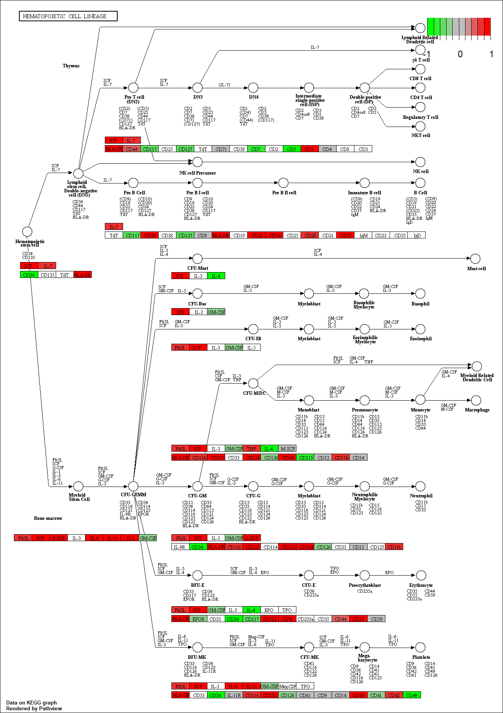

```{r setup, include=FALSE}
knitr::opts_chunk$set(echo = TRUE)
```

##RNA sequence analisys 

The data for for hands-on session comes from GEO entry: GSE37704, which is associated with the following publication:

Trapnell C, Hendrickson DG, Sauvageau M, Goff L et al. "Differential analysis of gene regulation at transcript resolution with RNA-seq". Nat Biotechnol 2013 Jan;31(1):46-53. PMID: 23222703

```{r}
metaFile <- "GSE37704_metadata.csv"
countFile <- "GSE37704_featurecounts.csv"
```


```{r}
colData = read.csv(metaFile, row.names=1)
head(colData)
```

```{r}
countData = read.csv(countFile, row.names=1)
head(countData)
```
 #remove column 1
```{r}
countData <- as.matrix(countData[,-1])
head(countData)
```

#filtering count data where ther eis 0 read count across all samples
```{r}
countData = countData[rowSums(countData)>0, ]
head(countData)
```

```{r}
nrow(countData)
```

# Running DESeq2

```{r}
library(DESeq2)

```

```{r}
dds = DESeqDataSetFromMatrix(countData=countData,
                             colData=colData,
                             design=~condition)
dds = DESeq(dds)
```

```{r}
res=results(dds)
```

```{r}
summary(res)
```

#Volcano plot
  
  
  #abline(v=c(2,2), col="green", lty=2, lwd=2)
abline(h=-log(0.01), col="green", lty=2, lwd=2)

```{r}
plot(res$log2FoldChange, -log(res$padj), xlab="Log2(FoldChange)", ylab="-Log(P-value)" )

abline(v=c(-2,2), col="green", lty=2, lwd=2)
abline(h=-log(0.01), col="green", lty=2, lwd=2)


```

#colors volcano add


```{r}
library("AnnotationDbi")
library("org.Hs.eg.db")
```

#add annotation
Use the mapIDs() function multiple times to add SYMBOL, ENTREZID and GENENAME annotation to our results by completing the code below.
```{r}
library("AnnotationDbi")
library("org.Hs.eg.db")

columns(org.Hs.eg.db)


```


```{r}
res$symbol = mapIds(org.Hs.eg.db,
                    keys=row.names(res), 
                    keytype="ENSEMBL",
                    column="SYMBOL",
                    multiVals="first")

res$entrez = mapIds(org.Hs.eg.db,
                    keys=row.names(res),
                    keytype="ENSEMBL",
                    column="ENTREZID",
                    multiVals="first")

res$name =   mapIds(org.Hs.eg.db,
                    keys=row.names(res),
                    keytype="ENSEMBL",
                    column="GENENAME",
                    multiVals="first")

head(res, 10)
```


```{r}
head(as.data.frame)
```


 how to choose the p-values
```{r}
res = res[order(res$pvalue),]
write.csv(res,file="deseq_results.csv")
```


```{r}
library(pathview)
library(gage)
library(gageData)

```


```{r}

data(kegg.sets.hs)
data(sigmet.idx.hs)
```


```{r}
kegg.sets.hs = kegg.sets.hs[sigmet.idx.hs]
```

```{r}
head(kegg.sets.hs, 3)
```
 #foldchanges is a new vector

```{r}
foldchanges = res$log2FoldChange
names(foldchanges) = res$entrez
head(foldchanges)
```


```{r}
keggres = gage(foldchanges, gsets=kegg.sets.hs)
```

```{r}
attributes(keggres)
```

```{r}
head(keggres$less)
```


```{r}
head(keggres$greater)
```

```{r}
head(keggres$stats)
```

```{r}
pathview(gene.data=foldchanges, pathway.id="hsa04110")
```


```{r}
pathview(gene.data=foldchanges, pathway.id="hsa04110", kegg.native=FALSE)
```

```{r}
keggrespathways <- rownames(keggres$greater)[1:5]
keggresids = substr(keggrespathways, start=1, stop=8)
keggresids
```

```{r}
pathview(gene.data=foldchanges, pathway.id=keggresids, species="hsa")
```



#Section3

```{r}
data(go.sets.hs)
data(go.subs.hs)
```

```{r}
gobpsets = go.sets.hs[go.subs.hs$BP]

gobpres = gage(foldchanges, gsets=gobpsets, same.dir=TRUE)

lapply(gobpres, head)
```

#Section4


