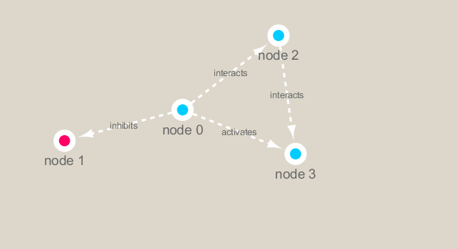

```{r setup, include=FALSE}
knitr::opts_chunk$set(echo = TRUE)
```

## R Markdown

```{r}
library(RCy3)
library(igraph)
library(RColorBrewer)
```

```{r}
#cytoscapePing()
```

```{r}
#cytoscapeVersionInfo()
```

```{r}
#g <- makeSimpleIgraph()
#createNetworkFromIgraph(g,"myGraph")
```

```{r}
#fig <- exportImage(filename="demo", type="png", height=350)
```

```{r}
knitr::include_graphics("./demo.png")
```


#change setting of cytoscape
#network style

```{r}
#setVisualStyle("Marquee")
```

#Tells Cytoscape to make image
```{r}
#fig <- exportImage(filename="demo_marquee", type="png", height=350)


```


#plot in R

```{r}
#g
```


```{r}
#plot(g)
```


#Metagenomics data (2015)

```{r}
prok_vir_cor <- read.delim("virus_prok_cor_abundant.tsv", stringsAsFactors = FALSE)

head(prok_vir_cor)
```

#igraph **graph.data.frame()**

```{r}
g <- graph.data.frame(prok_vir_cor, directed = FALSE)
```

```{r}
plot(g)
```

#now we are going to edit (g) to make it look pretty and analyze it.

```{r}
class(g)
```


```{r}
g
```

#845 verticles (nodes) and 1544 edges (linking) UNW-network set up 


```{r}
plot(g, vertex.size=3, vertex.label=NA)
```

#SEND TO CYTOSCAPE

```{r}
#createNetworkFromIgraph(g,"myIgraph")
```

#Network querys and Centrality analysis

```{r}
pr <- page_rank(g)
head(pr$vector)
```

# Make a size vector btwn 2 and 20 for node plotting size

```{r}
 d <- degree(g)
hist(d, breaks=30, col="lightblue", main ="Node Degree Distribution")
```

```{r}
plot( degree_distribution(g), type="h" )
```


```{r}
v.size <- BBmisc::normalize(pr$vector, range=c(2,20), method="range")
plot(g, vertex.size=v.size, vertex.label=NA)
```

```{r}
v.size <- BBmisc::normalize(d, range=c(2,20), method="range")
plot(g, vertex.size=v.size, vertex.label=NA)
```
#another example
 
 
```{r}
b <- betweenness(g)
v.size <- BBmisc::normalize(b, range=c(2,20), method="range")
plot(g, vertex.size=v.size, vertex.label=NA)
```
 
#Read taxonomic classification for network annotation
#RefSeq on Blast

```{r}
phage_id_affiliation <- read.delim("phage_ids_with_affiliation.tsv")
head(phage_id_affiliation)
```


```{r}
bac_id_affi <- read.delim("prok_tax_from_silva.tsv", stringsAsFactors = FALSE)
head(bac_id_affi)
```


#Add taxonomic annotation data to network
#In preparation for sending the networks to Cytoscape we will add in the taxonomic data.


#extract vertex names

```{r}
genenet.nodes <- as.data.frame(vertex.attributes(g), stringsAsFactors=FALSE)
head(genenet.nodes)
```

```{r}
length( grep("^ph_",genenet.nodes[,1]) )
```


# dont need all annotation data so lets make a reduced table 'z' for merging
```{r}
z <- bac_id_affi[,c("Accession_ID", "Kingdom", "Phylum", "Class")]
n <- merge(genenet.nodes, z, by.x="name", by.y="Accession_ID", all.x=TRUE)
head(n)
```

```{r}
colnames(n)
```


```{r}
colnames(phage_id_affiliation)
```

```{r}
# Again we only need a subset of `phage_id_affiliation` for our purposes
y <- phage_id_affiliation[, c("first_sheet.Phage_id_network", "phage_affiliation","Tax_order", "Tax_subfamily")]

# Add the little phage annotation that we have
x <- merge(x=n, y=y, by.x="name", by.y="first_sheet.Phage_id_network", all.x=TRUE)

## Remove duplicates from multiple matches
x <- x[!duplicated( (x$name) ),]
head(x)
```


```{r}
genenet.nodes <- x
```


#Send to Cytoscape using RCy3
